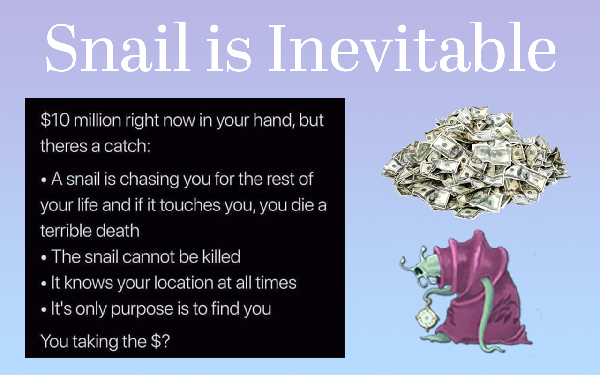

# Snail is Inevitable



This is a Chrome Extension that places a (hidden) snail somewhere on your browser page and slowly moves towards  your cursor. It is inspired by the [Immortal Snail thought experiment](https://knowyourmeme.com/memes/immortal-snail) (and its [variations](https://twitter.com/InternetH0F/status/1675522280087011329)). 

This extension has its fair share of bugs and interactions with various types of web pages that can cause the snail to behave improperly. Let me know if you find any at [unoptimalblogs@gmail.com](mailto:unoptimalblogs@gmail.com)

In the release, the snail (which is hidden from the user) moves one pixel every 30 minutes which is insanely slow. If you wish to play around with the extension feel free to download the code and change the following lines in background.js:

```
visible: false, // initial visibility of the snail
stepSize: 1, // the size of each step the snail makes in pixels
frequency: 1800000, // how often the snail moves, in milliseconds
```

```
if (distance <= 1) {  // show the snail when X pixels away from the cursor
    snailStatus.visible = true;
} else {
    snailStatus.visible = false;
}
```